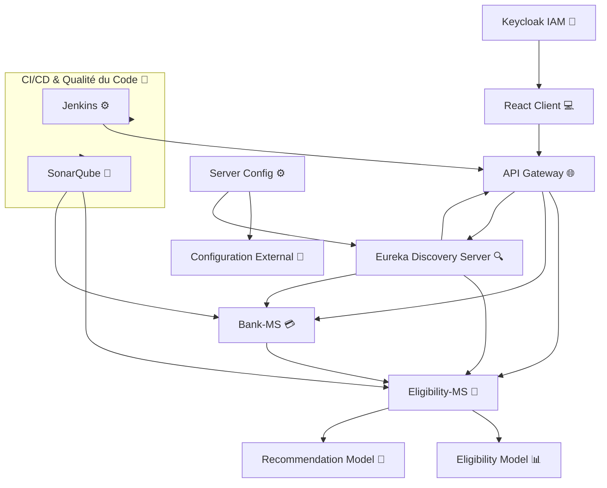

<h1 align="center">
  <br>
   AI-Driven Credit Eligibility Evaluation and Recommendation System
  <br>
</h1>

<h4 align="center"> Automatiser l'évaluation de l'éligibilité des clients aux crédits en utilisant l'intelligence artificielle pour des décisions rapides et personnalisées.</h4>

<div align="center">
  <a href="https://spring.io/projects/spring-boot">
    
  </a>
  <a href="https://spring.io/projects/spring-batch">
    
  </a>
  <a href="https://www.keycloak.org/">
    
  </a>
  <a href="https://reactjs.org">
    
  </a>
  <a href="https://tailwindcss.com/">
    
  </a>
  <a href="https://www.jenkins.io/">
    
  </a>
  <a href="https://www.sonarqube.org/">
    
  </a>
</div>


<br/>
<p align="center">
  
</p>

# 🌐 Overview

Credify est une solution innovante développée pour moderniser et automatiser le processus d'évaluation et d'attribution des crédits bancaires. Cette plateforme intègre des technologies de pointe en intelligence artificielle pour révolutionner la manière dont les institutions financières évaluent les demandes de crédit et accompagnent leurs clients.

# 🎯 Objectifs du Projet

- 🤖 **Automatisation Intelligente**: Évaluation automatique de l'éligibilité au crédit via machine learning
- 🛡️ **Gestion des Risques**: Minimisation des risques financiers grâce à une analyse approfondie
- 💡 **Recommandations Personnalisées**: Suggestions adaptées aux profils clients
- 🎯 **Efficacité Opérationnelle**: Interface intuitive pour les agents bancaires

## 🔧 Technologies Utilisées

### 🎯 Backend
- 🍃 **Spring Boot**: Framework principal pour les microservices
- 🐍 **Python/Django**: Traitement des données et modèles ML
- 🔄 **Spring Batch**: Traitement des données par lots
- 🔐 **Keycloak**: Gestion de l'authentification et autorisation

### 💻 Frontend
- ⚛️ **React**: Interface utilisateur moderne et responsive
- 🎨 **Material-UI**: Composants UI élégants

### 🔨 Architecture & Outils
- 🏗️ **Architecture Microservices**: Architecture distribuée pour une meilleure scalabilité
- 🔍 **Eureka**: Découverte dynamique des services
- 🌐 **API Gateway**: Gestion centralisée des requêtes et sécurité
- ⚡ **Config Server**: Configuration externalisée sur GitHub

### 🚀 CI/CD & Qualité du Code
- ⚙️ **Jenkins**: Automatisation des pipelines d'intégration et de déploiement continus
- 📊 **SonarQube**: Analyse statique du code pour assurer la qualité et la sécurité
- 🐳 **Docker**: Conteneurisation des applications pour une portabilité et une reproductibilité optimales
- ☸️ **Kubernetes**: Orchestration des conteneurs pour un déploiement scalable et résilient

## 🏗️ Architecture du Système

Notre système est basé sur une architecture microservices moderne comprenant:

- **API Gateway**: Point d'entrée centralisé
- **Service d'Éligibilité**: Évaluation des demandes de crédit
- **Service Bancaire**: Gestion des opérations bancaires
- **IAM Keycloak**: Gestion des identités et accès
- **Eureka Server**: Découverte de services
- **Configuration Externe**: Gestion centralisée des configurations


## 🚀 Installation et Démarrage

### 📋 Prérequis

- ☕ Java JDK 17+
- 📦 Node.js 18+
- 🐳 Docker & Docker Compose
- 🛠️ Git
- 🌐 GitHub Account
- 🔑 Keycloak

### 1️⃣ Configuration GitHub et Config Server

```bash
# Cloner le repository de configuration
git clone https://github.com/ia-project-org/ConfigServer.git

# Créer les fichiers de configuration pour chaque service
cd config-server-repo

# Exemple pour eligibility-service.yml
spring:
  application:
    name: eligibility-service
  datasource:
    url: jdbc:postgresql://localhost:5432/eligibility_db
    username: ${DB_USERNAME}
    password: ${DB_PASSWORD}

# Exemple pour bank-service.yml
spring:
  application:
    name: bank-service
  datasource:
    url: jdbc:postgresql://localhost:5432/bank_db
    username: ${DB_USERNAME}
    password: ${DB_PASSWORD}

# Pousser les configurations
git add .
git commit -m "Initial config files"
git push
```

### 2️⃣ Configuration de Keycloak

```bash
# Démarrer Keycloak avec Docker
docker-compose up -d keycloak

# Accéder à l'interface admin: http://localhost:8080/auth

# 1. Créer un nouveau realm 'banking-app'
# 2. Créer les clients:
#   - frontend-app (public)
# 3. Configurer les rôles:
#   - ROLE_AGENT
# 4. Créer les utilisateurs de test
```

### 3️⃣ Configuration des Variables d'Environnement

Pour le Backend (.env):
```env
# Config Server
CONFIG_SERVER_URI=http://localhost:8888
CONFIG_SERVER_USERNAME=root
CONFIG_SERVER_PASSWORD=secret

# Database
DB_USERNAME=postgres
DB_PASSWORD=secret
DB_HOST=localhost
DB_PORT=5432

# Keycloak
KEYCLOAK_AUTH_SERVER_URL=http://localhost:8080/auth
KEYCLOAK_REALM=banking-app
KEYCLOAK_RESOURCE=eligibility-service
KEYCLOAK_SECRET=your-client-secret
```

Pour le Frontend (.env):
```env
VITE_API_URL=url de gateway
VITE_PUBLIC_KEYCLOAK_REALM=e-banking
VITE_PUBLIC_KEYCLOAK_CLIENT_ID=e-banking-rest-api
VITE_PUBLIC_KEYCLOAK_CLIENT_SECRET=votre-scret
VITE_PUBLIC_KEYCLOAK_URL=http://localhost:8080
```

### ⚠️ Notes Importantes
- Vérifiez que les ports ne sont pas déjà utilisés
- Les fichiers .env ne doivent jamais être commités dans le repository
- Gardez les secrets Keycloak en sécurité

## 🌟 Remerciements

- 🙏 Merci à tous les contributeurs  
- 💪 Construit avec une stack technologique moderne  
- 🚀 Propulsé par Spring Boot et React  

---  
⭐ N'oubliez pas de donner une étoile à ce dépôt si vous le trouvez utile !  

---
<div align="center">
  Made with ❤️ in Morocco
</div>
